# Fleet Manager

### Multi-Company Fleet & Rental Management Platform

A working reference implementation of a **multi-tenant SaaS architecture built with Flutter and Firebase**.

Fleet Manager demonstrates how a centralized platform can manage multiple companies while keeping company authentication, business data and Firebase environments separated.

> **Source code is private. This repository is a portfolio showcase of the application architecture, features and user experience.**

---

## Product Demo

A 1 minute 50 second walkthrough showcasing the Fleet Manager application.

**Demo video:** [Watch Fleet Manager Demo](https://www.youtube.com/watch?v=Buat7V-SND8)

---

## Platform Overview

Fleet Manager is designed around a centralized **Super Admin + multi-company architecture**.

The same Flutter application foundation can support different companies and business workflows while maintaining isolated company environments.

---

## Architecture

### Central Platform

- Super Admin authentication
- Company directory
- Company management
- Package and feature management
- Entitlement management
- Centralized administration
- Company environment configuration

### Company Environment

Each company can operate through its own Firebase environment containing:

- Company authentication
- Company users
- Role-based access
- Firestore business data
- Storage
- Company-specific configuration
- Business operations

---
## Core Capabilities

### Multi-Company Management

- Centralized company selection
- Multiple company environments
- Super Admin company management
- Company-specific configuration
- Company-isolated business data

### Authentication & Access

- Super Admin authentication
- Company-specific authentication
- Role-based access
- Admin and worker workflows
- Device management and registration

### Fleet Management

- Vehicle management
- Vehicle brand identification
- Vehicle details
- Assignment workflows
- Daily vehicle history
- Financial history per vehicle

### Financial Management

- Income tracking
- Expense tracking
- Transaction history
- Profit calculation
- Vehicle-level financial summaries

### Rental Management

- Rental creation
- Customer information
- Rental details
- Rental agreement generation
- Signature workflow
- PDF documentation

### Reporting

- Daily reports
- Vehicle-level reports
- Income and expense summaries
- Profit overview
- Historical financial records

### User Experience

- Modern Flutter UI
- Light and dark themes
- Responsive dashboards and cards
- Consistent design system
- Animated splash experience
- Centralized error and feedback handling

---

## Technology Stack

| Technology | Purpose |
|---|---|
| Flutter | Cross-platform application |
| Dart | Application development |
| Firebase Authentication | Authentication |
| Cloud Firestore | Business data |
| Firebase Storage | File storage |
| Dynamic Firebase environments | Company-specific environments |
| PDF generation | Rental and reporting documents |

---
## Screenshots

Elected screens from the Fleet Manager application.

### Company Selection

Multi-company entry point with company search and selection.

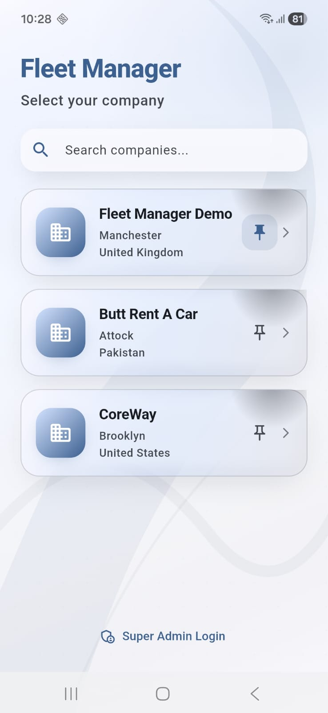

### Super Admin Login

Secure entry point for centralized platform administration.

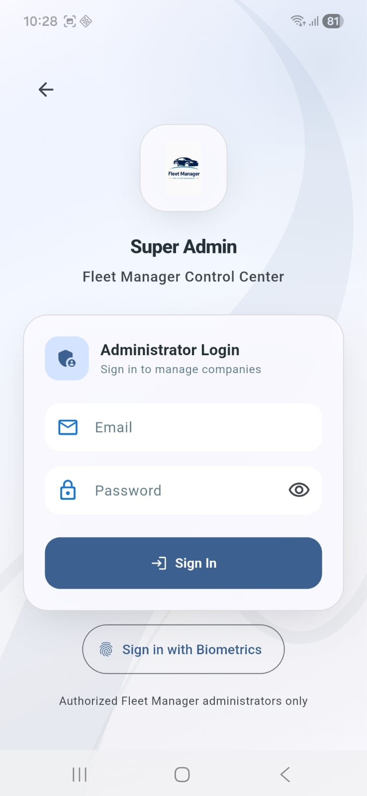

### Super Admin — Company Management

Centralized company management, details and configuration.

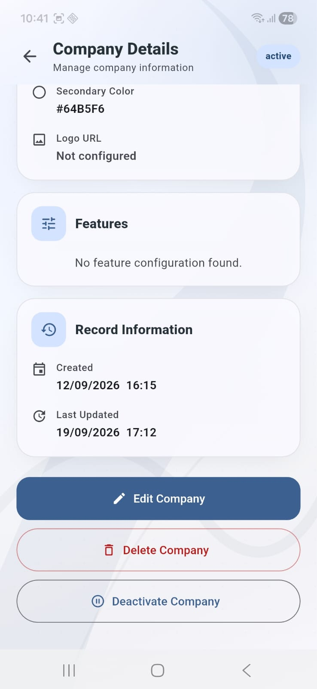

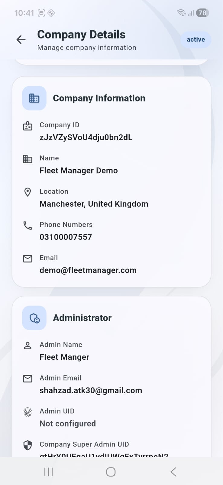

### Super Admin — Edit Company

Company configuration and management workflow.

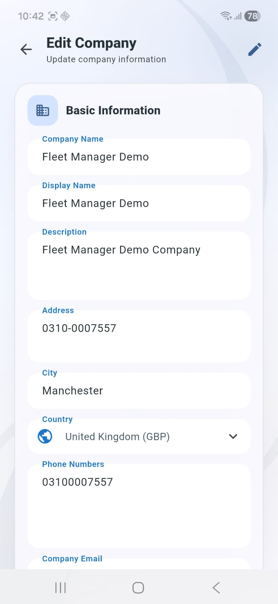

### Super Admin – Add Company

Create and configure a new company environment.

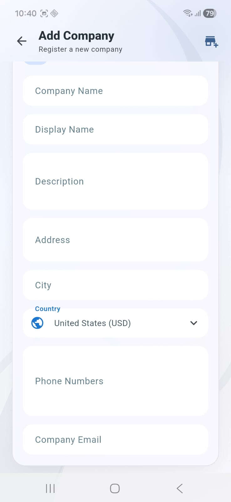

### Super Admin – Packages

Package and feature configuration for companies.

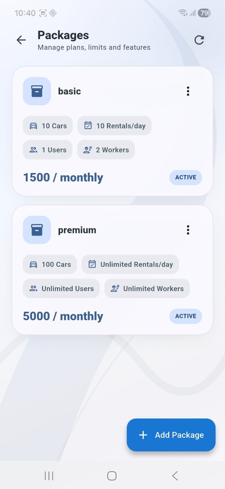

### Admin Dashboard

Business overview with fleet information and financial summaries.

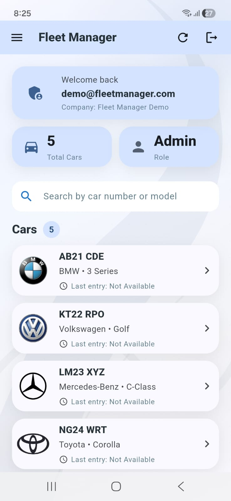

### Admin Dashboard — Full View

Full dashboard experience showing the wider business overview.

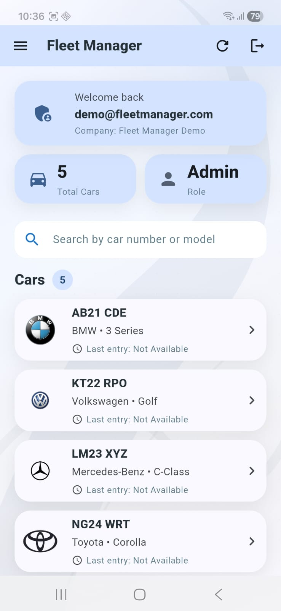

### Navigation

Full application navigation menu for accessing business modules.

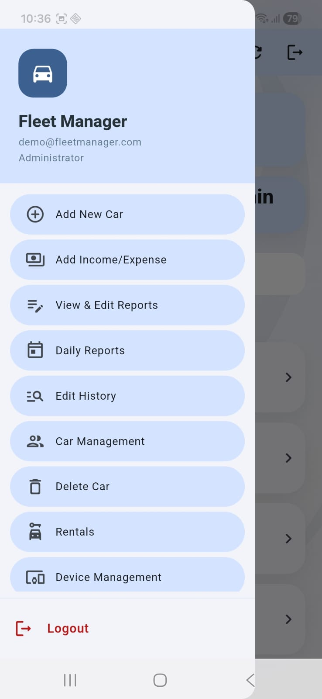

### Fleet & Car Management

Vehicle management workflow including car deletion controls.

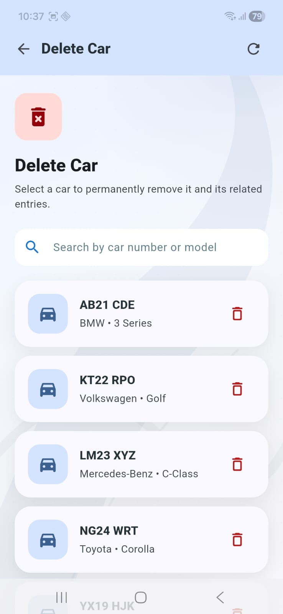

### Income & Expense

Financial transaction management for business income and expenses.

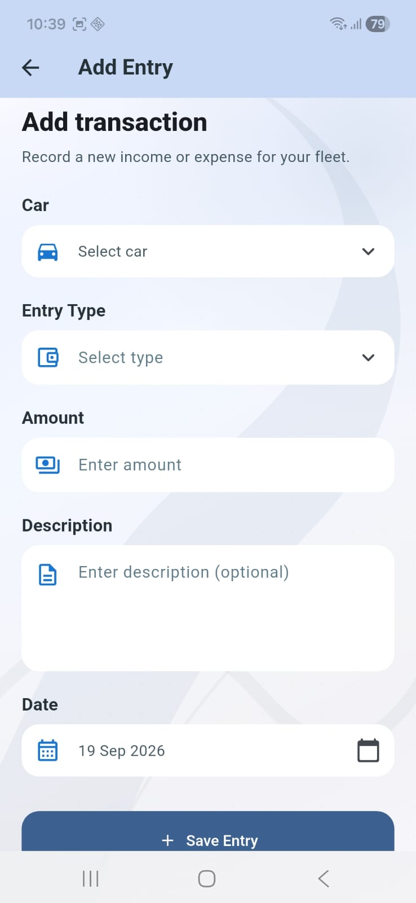

### Edit Entry

Transaction editing workflow from the reports interface.

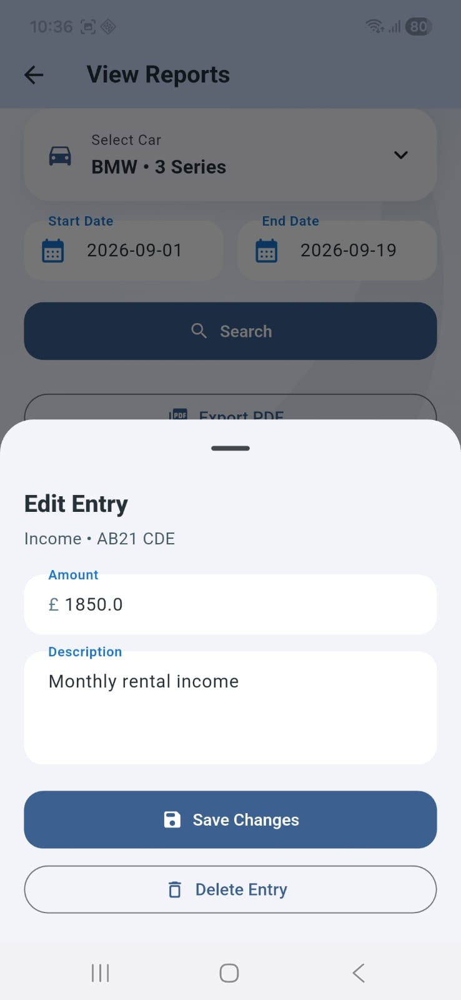

### Rental Management

Rental creation workflow and agreement process.

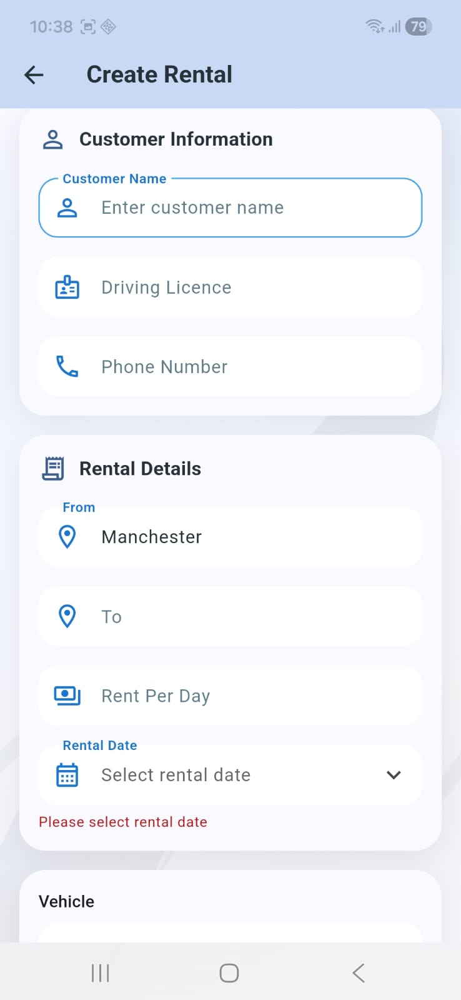

### Daily Reports
Daily financial reporting with income, expense and profit information.

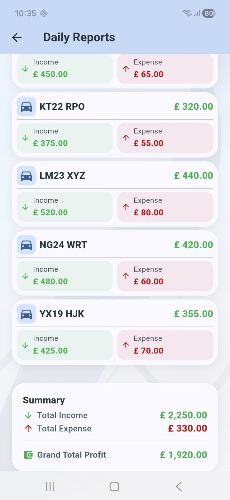

### View Reports
Historical financial reporting and transaction review.

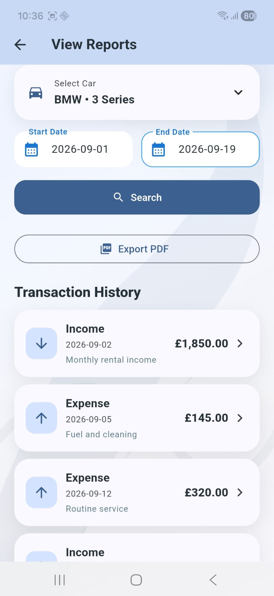

### Device Management
Registered device administration and access control.

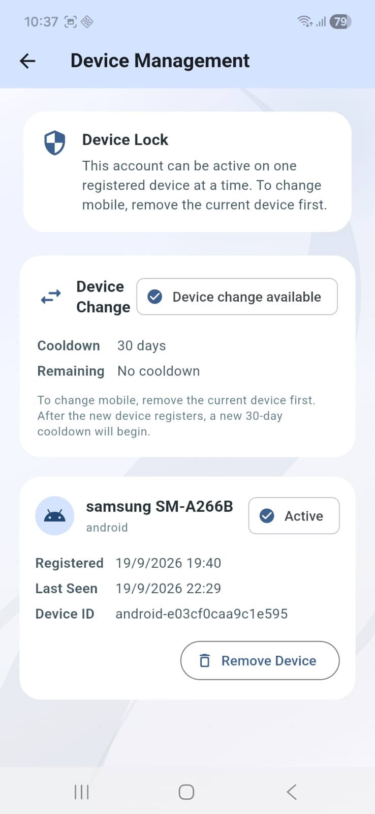

---

## Potential Business Applications

The architecture can be adapted beyond fleet and rental management.

Possible applications include:

- Fleet and vehicle management
- Rental businesses
- Inventory and warehouse systems
- Education management
- Restaurant management
- Real estate management
- Service businesses
- Equipment management
- Custom business SaaS platforms

These represent potential adaptations of the architecture and are not claims that every listed domain is currently implemented.

---

## Development Approach

The platform follows a reusable business-application architecture:

1. Centralized platform administration
2. Company-specific environments
3. Role-based authentication
4. Modular business features
5. Configurable entitlements
6. Local caching where appropriate
7. Consistent UI and design system
8. Centralized error handling
9. Reporting and document workflows
10. Cross-platform Flutter foundation

---
## Project Status

Fleet Manager is an ongoing working reference implementation used to demonstrate the development of custom Flutter and Firebase business applications.

The project continues to evolve as new platform capabilities and business workflows are added.

---

## About

**Fleet Manager**

Smart Fleet & Rental Management

**Designed & Developed by Team Shahzad**

Building custom Flutter and Firebase applications around real business workflows.

---

## Contact

For custom Flutter, Firebase and business application development:

**Email:** shahzad.atk30@gmail.com

**WhatsApp:** +92 331 5757557

---

## Source Code

The source code for Fleet Manager is private.

This repository intentionally contains only portfolio material, documentation, architecture information and selected screenshots.

For development inquiries or architecture discussions, please get in touch.
